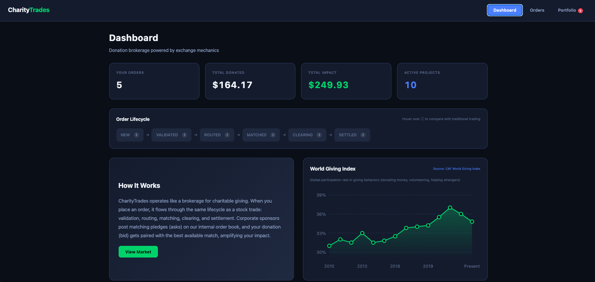
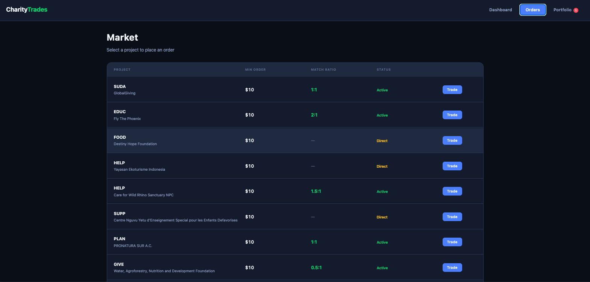
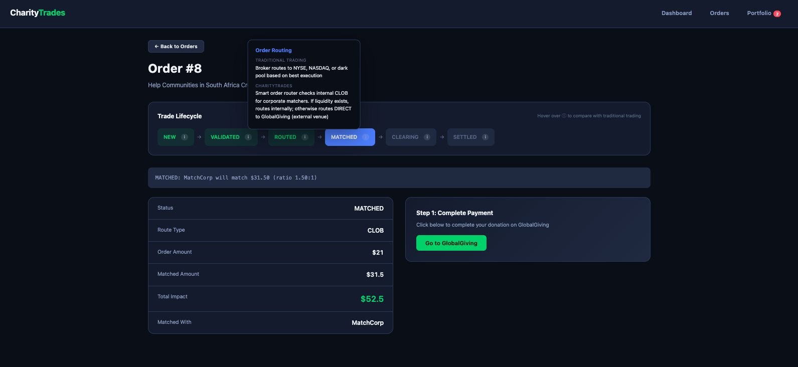
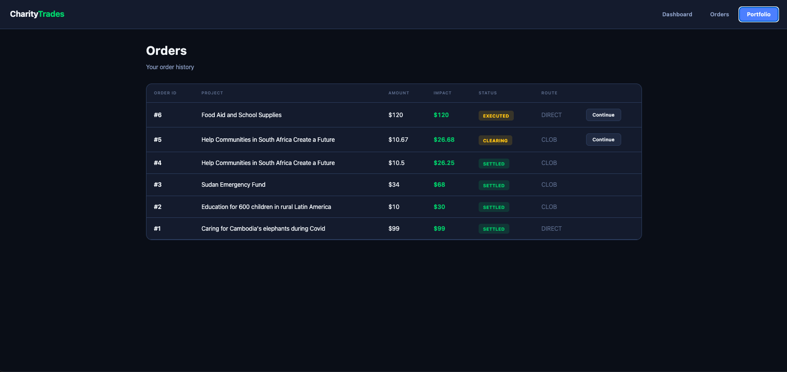

# CharityTrades

A donation brokerage that applies real securities trading mechanics to charitable giving.



## What Is This?

CharityTrades treats donations like stock trades. When you donate, your order flows through the same lifecycle as a buy order on Wall Street: validation, routing, matching, clearing, and settlement.

Corporate sponsors post matching pledges (like sell orders), and your donation (like a buy order) gets paired with the best available match on our internal order book.

## How It Mimics Real Trading

| Trading Concept | CharityTrades Equivalent |
|-----------------|--------------------------|
| **Brokerage** | CharityTrades (manages accounts, validates, routes) |
| **Buy Order (Bid)** | Donation order from personal account |
| **Sell Order (Ask)** | Matching pledge from corporate account |
| **Price** | Match ratio (1:1, 2:1, etc.) |
| **Credit Risk Check** | Validates donation meets minimum amount |
| **Smart Order Router** | Decides: match internally or route direct to GlobalGiving |
| **Central Limit Order Book** | Internal book pairing donations with corporate pledges |
| **Matching Engine** | Pairs your donation with best available matcher |
| **Clearing** | Post-trade verification (user completing payment) |
| **Settlement** | T+0: Donation confirmed and recorded |

## Order Lifecycle

Every donation follows this path:

```
NEW → VALIDATED → ROUTED → MATCHED/EXECUTED → CLEARING → SETTLED
```

| Step | What Happens | Traditional Trading Equivalent |
|------|--------------|-------------------------------|
| **NEW** | Order received | Buy order submitted to broker |
| **VALIDATED** | Amount checked against minimum | Broker checks if you have funds/margin |
| **ROUTED** | Router picks internal match or direct | Broker routes to NYSE, NASDAQ, or dark pool |
| **MATCHED** | Paired with corporate matcher | Your bid matched a seller's ask |
| **EXECUTED** | No matcher, routed direct | Market order executed at best price |
| **CLEARING** | User clicking donation link | Clearinghouse verifies both sides |
| **SETTLED** | Donation confirmed | T+2: Securities and cash exchanged |

## Screenshots

### Dashboard
Overview of your activity, lifecycle visualization with tooltips comparing each step to traditional trading, and a chart showing global giving trends.


### Market (Orders Page)
Browse available projects. Each shows the match ratio (if corporate matchers exist) and status. "Active" means matchers are available; "Direct" means your donation routes straight to GlobalGiving.



### Place Order
Select a project and enter your donation amount. The system validates, routes, and matches your order in real-time.



### Portfolio
Track all your orders. See status, matched amounts, total impact, and continue incomplete orders.



## Routing Logic

CharityTrades acts as both broker and exchange:

```
                    Order Placed
                         │
                         ▼
              Any matchers for project?
                         │
                 ┌───────┴───────┐
                YES              NO
                 │               │
                 ▼               ▼
          INTERNAL MATCH      DIRECT
        (CharityTrades CLOB) (GlobalGiving)
                 │               │
                 ▼               ▼
              MATCHED         EXECUTED
```

- **INTERNAL MATCH**: Order hits internal CLOB, pairs with corporate pledge, amplifies impact
- **DIRECT**: No matchers available, routes straight to GlobalGiving

## Tech Stack

- **Backend**: Java 21, Spring Boot 4
- **Database**: PostgreSQL
- **Frontend**: React + Vite
- **External API**: GlobalGiving

## Running Locally

```bash
# 1. Create database
createdb charitytrades

# 2. Start backend (port 8080)
./mvnw spring-boot:run

# 3. Start frontend (port 5173)
cd frontend && npm install && npm run dev
```

## API

| Method | Endpoint | Description |
|--------|----------|-------------|
| GET | /api/projects | List all projects |
| POST | /api/orders | Place donation order |
| POST | /api/orders/{id}/clearing | Start clearing |
| POST | /api/orders/{id}/settle | Settle order |
| GET | /api/matching-orders | List corporate pledges |
| POST | /api/matching-orders | Create corporate pledge |

## Data Sources

- **Projects**: GlobalGiving API (imported on startup)
- **World Giving Index**: CAF (Charities Aid Foundation) 2010-2023
